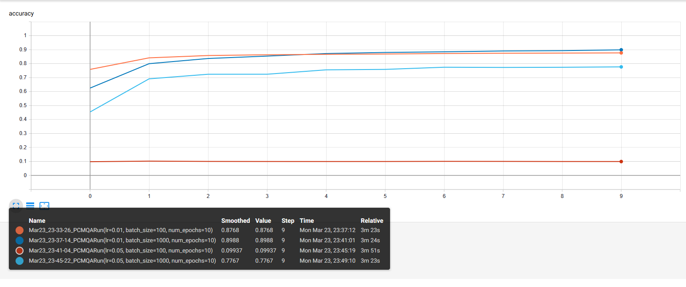

# PyTorch-CNN-FashionMNIST
PyTorch Convolutional Neural Network trained on FashionMNIST dataset

# Project's outline:

## 1. Prepare the data (Extract Transform Load)

1.1 Extract - Get the FashionMNIST dataset.

1.2 Transform - Put the data into tensor form.

1.3 Load - Put the data into an object to make it easily accessible. Using torchvision and DataLoader packages.

## 2. Build the model (network)

2.1 The Network class must extend nn.Module.

2.2 Define the layers in the constructor using nn package.

2.3 Implement the forward() method.

## 3. Train the model

3.1. Get batch from the training set (using the created DataLoader).

3.2. Pass batch to network (call the network object directly).

3.3. Calculate the loss (difference between the predicted values and true values) **LOSS FUNCTION** (using functional package).

3.4. Calculate the gradient of the loss function w.r.t the network's weights **BACKPROP** (backward() function)

3.5. Update the weights using the gradients to reduce the loss **OPTIMIZATION ALGORITHM** (using optim package)

3.6. Repeat steps 1-5 until one epoch is completed (EPOCH=complete pass through all samples of the training set)

3.7. Repeat steps 1-6 for as many epochs required to obtain the desired level of accuracy.

## 4. Hyperparameters' tuning

4.1. **RunBuilder** class allow automatic building of the all possible runs based on a dictionary of hyperparameters that can be changed in `main.py`.

## 5. Test the model

5.1. Get a specific run.

5.2. Get batch from the test set.

5.3. Pass the batch to the network.

5.4. Compute the loss and accuracy.

## 6. Analyze the results

6.1 Compute accuracy and create a confusion matrix (sklearn metrics).

6.2 Track the loss and accuracy.

6.3 Save the results (as tensorboard runs) and model to disk.

# Results

For the sake of testing the code, several training sessions were run very quickly. 

Here's a plot, from Tensorboard, of the training accuracy evolution for the different runs:

The best result I got so far on the test set is an accuracy of **0.876** corresponding to the Run(lr=0.01, batch_size=1000, num_epochs=10). 

# Usage 

Run `python main.py` .